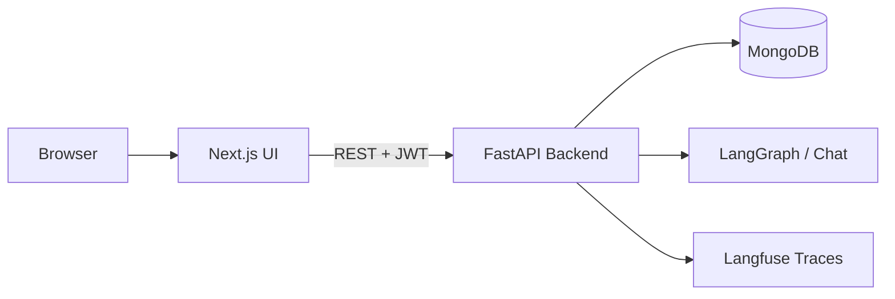

# ONE-AI UI

Enterprise frontend for **ONE-AI** — a platform to build, orchestrate, trace, and govern AI agents across organizations. This repository is the Next.js web application that connects to the ONE-AI FastAPI backend.

**Live product areas:** marketing landing page, authenticated admin console, and organization-scoped client workspace.

---

## Features

### Client workspace (`/client`)

Organization users manage their AI stack day to day:

| Area | Description |
|------|-------------|
| **Dashboard** | Metrics, agent activity, and system overview |
| **Agents** | Create and configure AI agents (prompts, tools, behavior) |
| **Tools** | Attach callable tools to agents |
| **DB Connections** | Connect databases; inspect auto-fetched schemas |
| **Playground** | Chat with a supervisor or individual agents; session history with auto-generated titles |
| **Analytics** | Usage and performance charts |
| **Traces** | Langfuse-backed execution traces with drill-down |
| **Users** | Manage organization members (permission-gated) |
| **Settings** | Theme, preferences |

### Admin console (`/admin`)

Platform operators manage the multi-tenant system:

| Area | Description |
|------|-------------|
| **Dashboard** | Cross-org metrics and alerts |
| **Organizations** | Create and manage tenants |
| **Users** | Provision users across organizations |
| **Agents** | Cross-org agent visibility |
| **Tool Registry** | Global tool catalog (super-admin) |
| **Playground** | Supervisor chat with org filter |
| **Traces** | Platform-wide trace inspection |

### Shared UX

- **RBAC** — sidebar and routes respect resolved permissions from the backend
- **Light / dark theme** — CSS variable design tokens with persistent preference
- **Command palette** — quick navigation (`⌘K` / `Ctrl+K`)
- **Responsive layout** — collapsible sidebar, mobile drawer
- **Landing page** — marketing site with animated hero, pricing, FAQ, and product showcase

---

## Tech stack

| Layer | Technology |
|-------|------------|
| Framework | [Next.js 16](https://nextjs.org) (App Router) |
| UI | React 19, TypeScript |
| Styling | Tailwind CSS v4, design tokens in `styles/tokens.css` |
| Components | shadcn/ui, Base UI, Lucide icons |
| Charts | Recharts |
| Motion | Motion, GSAP, Lenis (landing page) |
| Validation | Zod |
| API | REST client → FastAPI backend (`lib/api/`) |

---

## Prerequisites

- **Node.js** 20+
- **pnpm** (recommended) or npm
- **ONE-AI backend** running locally or deployed (FastAPI + MongoDB)

---

## Getting started

### 1. Clone and install

```bash
git clone <repository-url>
cd One-AI-UI
pnpm install
```

### 2. Configure environment

Create a `.env.local` file in the project root:

```env
# Backend API base URL (required)
NEXT_PUBLIC_API_URL=http://localhost:8000
```

The default in code is `http://localhost:8000` if this variable is omitted.

### 3. Run the backend

Start the ONE-AI API server separately. See the backend repository and [`API_REFERENCE.md`](./API_REFERENCE.md) for endpoints, auth, and Swagger docs at `/docs`.

### 4. Start the frontend

```bash
pnpm dev
```

Open [http://localhost:3000](http://localhost:3000).

- **Landing:** `/`
- **Login:** `/login`
- **Client dashboard:** `/client/dashboard`
- **Admin dashboard:** `/admin/dashboard`

Protected routes require a valid JWT stored in `localStorage` and an `access_token` cookie (set on login).

---

## Environment variables

| Variable | Required | Default | Description |
|----------|----------|---------|-------------|
| `NEXT_PUBLIC_API_URL` | No | `http://localhost:8000` | FastAPI backend base URL |

Additional flags for enterprise auth (registration, SSO) are documented in [`docs/enterprise-auth-onboarding.md`](./docs/enterprise-auth-onboarding.md).

---

## Project structure

```
app/
├── (auth)/              # Login, register, forgot-password
├── (dashboard)/
│   ├── admin/           # Super-admin / platform routes
│   └── client/          # Organization workspace routes
├── layout.tsx           # Root layout, theme provider
├── page.tsx             # Marketing landing page
└── globals.css          # Tailwind + global styles

components/
├── landing/             # Marketing sections
├── layout/              # Sidebar, top nav, command palette
├── dashboard/           # Dashboard widgets and charts
└── ui/                  # Shared UI primitives

contexts/                # Auth, theme, sidebar, toast
hooks/                   # Data fetching and UI hooks
lib/
├── api/                 # Typed REST clients per resource
├── validations/         # Zod schemas for forms
└── utils.ts

types/                   # Shared TypeScript types
styles/tokens.css        # Light/dark design tokens
proxy.ts                 # Route protection (auth redirect)
```

---

## Backend integration

All data flows through the REST API. The shared client lives in `lib/api/client.ts`:

- Sends `Authorization: Bearer <token>` on authenticated requests
- Redirects to `/login` on `401`
- Surfaces backend validation errors via `ApiError`

Main API modules:

| Module | Purpose |
|--------|---------|
| `authApi` | Login, register, `/auth/me`, permissions |
| `agentsApi` | Agent CRUD |
| `toolsApi` | Tool CRUD |
| `dbConnectionsApi` | Database connections and schema |
| `organizationsApi` | Organization management |
| `usersApi` | User provisioning |
| `chatApi` | LangGraph sessions, messages, history |
| `tracingApi` | Langfuse traces and stats |
| `toolRegistryApi` | Global tool catalog |

Full endpoint reference: [`API_REFERENCE.md`](./API_REFERENCE.md).

### Playground chat flow

1. User sends a message → `POST /chat/session` (if new) then `POST /chat/message`
2. Backend generates a session title in parallel and returns `name` on the message response
3. Frontend updates the sidebar title in place via `useChat` → `useSessions.updateSessionName`

---

## Authentication & permissions

- JWT obtained from `POST /auth/login` or registration endpoints
- Token stored in `localStorage` and mirrored to an `access_token` cookie for server-side route protection
- `AuthProvider` loads `/auth/me` and resolved permissions on startup
- `DashboardLayout` and sidebar items hide routes the user cannot access
- `proxy.ts` redirects unauthenticated users from `/admin/*` and `/client/*` to `/login`

Roles and permission flags (`create_agent`, `view_trace`, `create_chat_session`, etc.) are defined and enforced by the backend.

---

## Scripts

| Command | Description |
|---------|-------------|
| `pnpm dev` | Start development server |
| `pnpm build` | Production build |
| `pnpm start` | Serve production build |
| `pnpm lint` | Run ESLint |

---

## Theming

Theme state is managed by `ThemeProvider` (`contexts/theme-context.tsx`):

- Persists preference in `localStorage` under `ui-theme`
- Sets `data-theme` and the `dark` class on `<html>`
- Design tokens in `styles/tokens.css` drive surfaces, text, and borders

Dashboard and playground pages use CSS variables (`var(--bg)`, `var(--surface)`, etc.) for consistent light/dark behavior.

---

## Related documentation

| Document | Contents |
|----------|----------|
| [`API_REFERENCE.md`](./API_REFERENCE.md) | Backend REST API |
| [`docs/enterprise-auth-onboarding.md`](./docs/enterprise-auth-onboarding.md) | Enterprise auth and SSO notes |
| [`ONE_AI_V0_PROMPT.md`](./ONE_AI_V0_PROMPT.md) | Original product / UI generation spec |
| [`AGENTS.md`](./AGENTS.md) | Agent coding guidelines for this repo |

---

## Architecture overview



---

## License

Private — all rights reserved unless otherwise specified by the repository owner.
